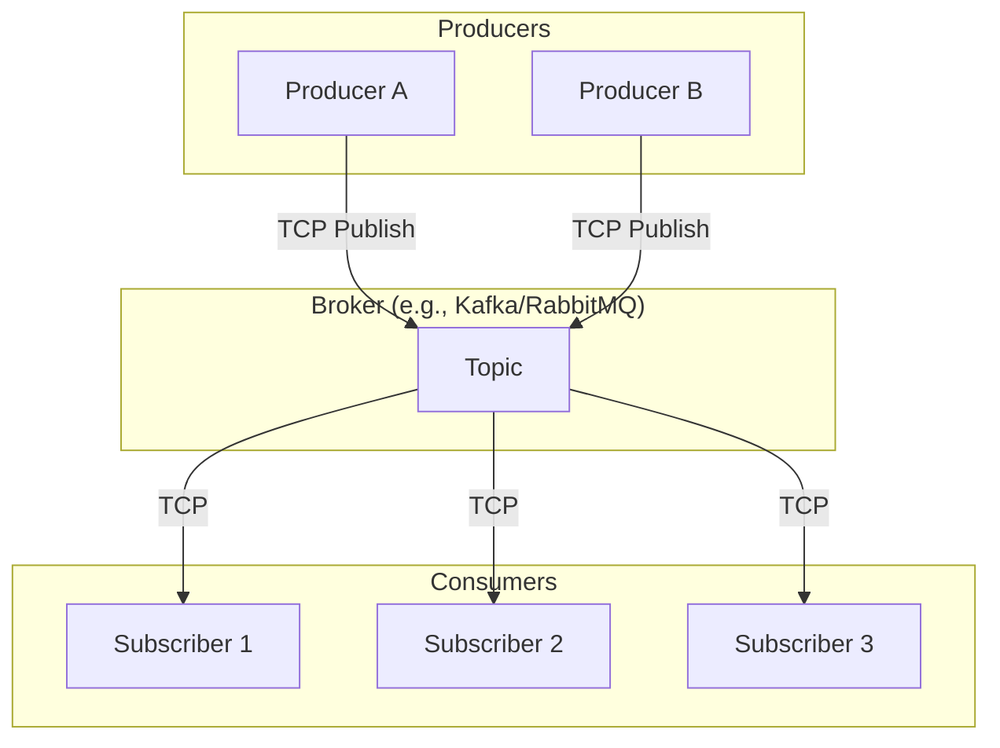
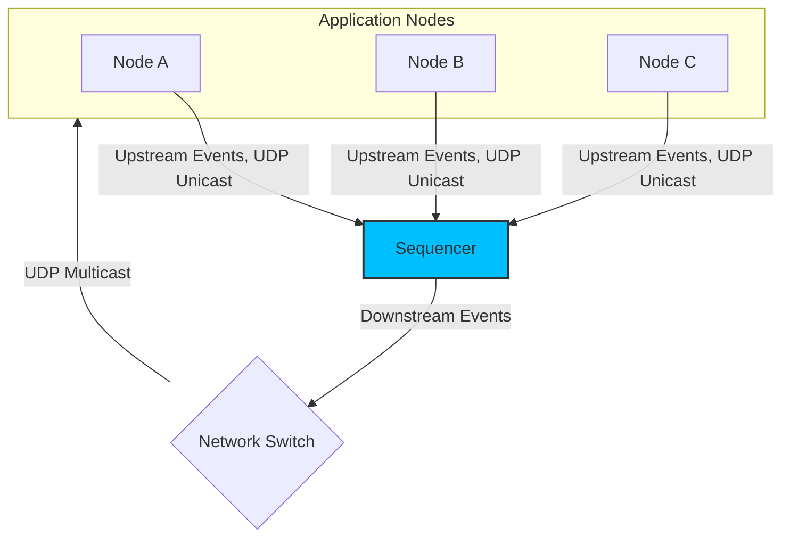
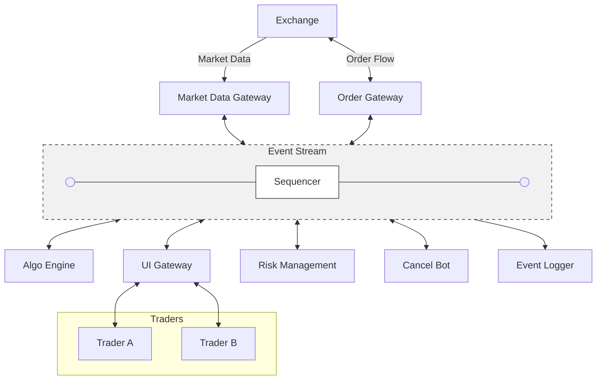

<!-- markdownlint-disable MD033 -->

# Distributed Systems & Sequencer Architecture

With a focus on low-latency FinTech applications.

## 1. Disclaimer

The views expressed are those of the speaker alone and do not represent the views of any past or current employers.

## 2. Introduction

A **distributed system** is a network of independent computers (nodes) that collaborate to achieve a shared goal, appearing to the user as a single, unified system.

## 3. Important Characteristics of Distributed Systems

Resilience, Fault Tolerance, Scalability, Availability, Consistency and Determinism.

- **Resilience** is the ability of the system to recover from failures and continue operating. Fail fast and restart fast.
- **Fault Tolerance** is the system's ability to continue functioning correctly even when some components fail, e.g. using redundancy.
- **Scalability** refers to the system's ability to handle increased load by adding more resources. (In FinTech applications, run-time elastic scalability is not always desired as it may lead to unpredictable latency. The system should be designed to handle peak loads efficiently).
- **Availability** ensures that the system is accessible and operational when needed.
- **Consistency** ensures that all nodes in the system have the same data at any given time.
- **Determinism** guarantees that given the same initial state and inputs, the system will always produce the same outputs.

## 4. Microservices Architecture vs Monolithic Architecture

- **Monolithic Architecture**: All components of the application are tightly integrated and run as a single process.
- **Microservices Architecture**: The application is broken down into smaller, independent services/nodes/actors that communicate over a network.

There are various trade-offs between the two architectures. But in the context of low-latency financial applications, microservices can introduce additional latency due to network communication, message serialization, deserialization, and inter-service synchronization. However, they can also provide better scalability and fault tolerance.

### 4.1. Communication Types

#### 4.1.1. Communication Scopes

| Scope | Definition |
| :--- | :--- |
| Intra-process (in-memory) | Inside one application, using multi-threaded message publishing |
| Inter-process (IPC) | Between different applications running on the same host |
| Distributed | Between different applications running on different hosts |

#### 4.1.2. Communication Modes

| Mode | Definition |
| :--- | :--- |
| Unicast | One-to-one/point-to-point communication, publish for every consumer separately |
| Multicast | One-to-many communication, publish once, multiple consumers receive the same message simultaneously |

### 4.2. Message Publishing Latency Benchmarks

| Architecture | Scope | Transport | Mode | Latency | Technology |
| :--- | :--- | :--- | :--- | :--- | :--- |
| Monolithic | Intra-process | In-memory | Multicast | 52 ns | LMAX Disruptor |
| Microservices | Inter-process | Shared Memory | Multicast | ~250 ns | Aeron Shared Memory IPC |
| Microservices | Distributed | UDP | Multicast | 4 - 8 us | Tuned Linux Stack, Standard NIC, busy-polling |
| Microservices | Distributed | TCP | Unicast | 10 - 15 us | Tuned Linux Stack, Standard NIC, busy-polling |

**TCP** transport guarantees reliable delivery and ordering but can introduce higher latency due to connection setup, congestion control, and retransmissions. Always 1-to-1.

**UDP multicast** can achieve lower latency but does not guarantee delivery or ordering, which is why it is often used in conjunction with a Sequencer architecture to ensure total ordering of events. Sequencer publishes events to all subscribers simultaneously, the receivers can detect missing messages and request retransmission, but the system can continue processing without waiting for acknowledgments, thus achieving lower latency. Refer to the MoldUDP64 protocol specification for more details on how this works.

## 5. Sequencer Architecture History

Island ECN (Electronic Communication Network) was one of the first to implement a Sequencer architecture in the late 1990s. It was designed to handle high-frequency trading and provide low-latency access to market data and order execution. The Sequencer architecture allowed Island ECN to achieve microsecond-level latency, which was a significant advantage in the competitive world of electronic trading.

Instinet acquired Island ECN in 2002 and continued to use the Sequencer architecture for its trading platform. The success of Island ECN's Sequencer architecture influenced other trading platforms and financial institutions to adopt similar designs to achieve low-latency performance.

Nasdaq acquired Instinet in 2005 and has continued to use and evolve the Sequencer architecture in its trading systems. The Sequencer architecture has become a standard design pattern in the financial industry for building low-latency trading platforms and is widely used by exchanges, brokerages, and other financial institutions.

## 6. Sequencer vs. Traditional Pub/Sub Architecture

Sequencer architecture is a specific design pattern within the microservices paradigm that addresses some of the latency and consistency challenges by introducing a central component (the Sequencer) that ensures total ordering of events across the system.

Traditional Pub/Sub systems typically rely on TCP-based brokers that guarantee ordering only within specific partitions or topics, rather than a total global order across the entire system. In contrast, the Sequencer architecture relies on a UDP multicast-based approach where a single logical component (the Sequencer) enforces a **total global order** by assigning a unique sequence number to every event. This enables deterministic **State Machine Replication** across all downstream services, typically utilizing UDP multicast for high-throughput, low-latency distribution. Also note that **UDP multicast** allows for **O(1) dissemination to any number of subscribers**, while TCP-based Pub/Sub systems often require a broker to manage connections and route messages, which can introduce additional latency (O(n) for n subscribers).

You may notice that UDP multicast does **not** guarantee delivery, but the Sequencer architecture relies on receiver-side NAKs (Negative Acknowledgments) to request retransmission of missed sequence numbers, allowing the system to continue processing without waiting for acknowledgments, thus achieving lower latency compared to TCP-based Pub/Sub systems. Please refer to the MoldUDP64 protocol specification for more details on how this works.

### 6.1. Traditional Pub/Sub (e.g., Kafka, JMS, RabbitMQ)

- **Ordering**: Guarantees order usually only within a partition or a specific topic. There is no global order across the entire system.
- **Mechanism**: Producers publish to a broker; the broker persists and routes to consumers.
- **Latency**: Often optimized for throughput and durability rather than wire-to-wire latency.
- **Reliability**: relies on TCP for reliable delivery, with acknowledgments and retries managed by the broker.
- **Performance**: O(n) for n subscribers.

### 6.2. Sequencer Architecture

- **Ordering**: Total Global Order. A single logical component (The Sequencer) assigns a unique, monotonically increasing sequence number to every input event.
- **Determinism**: This global ordering enables **State Machine Replication**. All downstream components (Matching Engines, Risk Checks, Market Data Gateways) process the same stream of sequenced events.
- **Mechanism**: Producers send events to the Sequencer via UDP unicast, which then multicasts the ordered stream to all subscribers simultaneously.
- **Reliability**: Unlike TCP-based Pub/Sub where the broker tracks delivery, Sequencer architectures often rely on receiver-side NAKs (Negative Acknowledgments) to request retransmission of missed sequence numbers.
- **Performance**: Often implemented using UDP Multicast (e.g., MoldUDP64) for O(1) dissemination to any number of subscribers, achieving microsecond-level latency.

Let's go over how the Sequencer architecture addresses the important characteristics of distributed systems we mentioned earlier.

**Resilience** is achieved through the State Machine Replication enabled by the total global ordering of events. If one node fails, it can be restarted and will catch up by processing the same sequence of events from the very beginning, ensuring a fast recovery without impacting the overall system.

**Fault Tolerance** The system can tolerate individual node failures without data loss because the "truth" resides in the sequenced event stream rather than the volatile memory of a single process. The Sequencer architecture allows for the use of redundant nodes (active/active, active/passive). The Sequencer itself is a single point of failure, it can be made fault-tolerant by running a passive backup Sequencer that can take over in case the primary fails, or by using a consensus protocol to elect a new Sequencer if the current one fails.

Horizontal **Scalability** is achieved by running multiple instances of downstream services/nodes (e.g., matching engines, risk checks, order gateways) that might be configured to process different subsets of events based on security instrument or trader ID.

**Availability:** High availability is maintained through Active/Active or Active/Passive configurations. Multiple replicas process the same stream of events. **Passive** node receives all downstream events, processes them but does not send any output to the Event Stream (Sequencer). It can take over immediately (become active) if the active node fails. **Active** nodes can send upstream events to the Sequencer. When two active replicas receive a downstream event, process it and send output to the Sequencer, given the deterministic nature of the architecture, both outputs will be sent with exactly the same sequence number (and expected to have exactly the same payload). The Sequencer will drop the duplicate event from the second active node, ensuring that only one output is published on the Event Stream for each sequence number.

**Consistency** and **Determinism** are guaranteed by the total global ordering of events. However, the developers implementing the downstream services/nodes must ensure that their processing logic is deterministic, meaning that given the same initial state and the same sequence of events, they will always produce the same output. This is crucial for maintaining consistency across all replicas.

## 7. Trading System Example with Sequencer Architecture

All nodes receive all events simultaneously (can technically drop/miss an event, but they can detect this and request retransmission without blocking the entire system).

**Market Data Gateway** receives market data updates from the **Exchange** and publishes them to the **Event Stream**.

**Algo Engine** uses this data to make a trading decision, and publishes new order request event on the **Event Stream**, which is then processed by the **Order Gateway** to send the order to the exchange.

**UI Gateway** updates the user interface for traders and displays market prices. Traders can also submit order requests through the UI, which are published to the **Event Stream** and processed by the **Order Gateway**.

**Cancel Bot** keeps track of all active orders and can trigger cancellation requests when certain conditions are met (e.g., time-in-force expiration, risk limits breached, trader workstation disconnect, **Algo Engine** heartbeat timeout). It publishes cancellation events to the **Event Stream**, which are processed by the **Order Gateway** to send cancellation requests to the exchange.

**Risk Management** node based on the received market data, evaluates the risk of orders created by traders or **Algo Engine(s)**. When risk limit breach is detected it may request cancellation by notifying the **Cancel Bot** to trigger a cancellation of all open orders for a specific trader or an entire trading desk. Risk limit examples: order price band (price range), max position size, max order value, max total order value per trader, trading desk or for the entire firm.

**Order Gateway** receives order requests from traders and **Algo Engine(s)**, validates them, and sends to the Exchange. **Order Gateway** receives order acknowledgments, fills, cancellations from the exchange and publishes them to the **Event Stream**.

**Event Logger** saves all events from the **Event Stream** for auditing, compliance, and post-trade analysis purposes.

## 8. Sequencer Technologies and Implementations

- **Aeron**: A high-performance, **open-source** messaging toolkit that provides reliable, low-latency transport for both inter-process (shared memory) and distributed (UDP) communication. Its efficiency makes it a foundational technology for implementing the core messaging layer of a Sequencer architecture.
- **CoralBlocks**: A **commercial** implementation of the Sequencer architecture designed for low-latency trading applications. It provides a high-performance event streaming platform that supports UDP multicast and is optimized for financial applications. It is one of the few commercially available products offering a complete, end-to-end solution for building a Sequencer-based trading system.
- **Custom In-House Implementations**: Many financial institutions have developed their own custom implementations of the Sequencer architecture tailored to their specific needs and requirements. These implementations often include proprietary optimizations and features to achieve the desired performance and reliability.
- **LMAX Disruptor**: A high-performance **open-source** inter-thread/intra-process messaging library that can be used to implement a Sequencer architecture within a single process. It provides a lock-free, ring-buffer-based design that allows for low-latency communication between threads.

## 9. References

- [Distributed Systems: Basics](https://medium.com/@naveenjain213.nj/distributed-systems-basics-78292e1e437e)
- [Latency Numbers Every Programmer Should Know](https://gist.github.com/jboner/2841832)
- [LMAX Disruptor](https://lmax-exchange.github.io/disruptor/)
- [Aeron](https://github.com/aeron-io/aeron)
- [CoralBlocks](https://www.coralblocks.com)
- [MoldUDP64 Protocol Specification](https://www.nasdaq.com/docs/moldudp64specv1.00.pdf)
- [The Sequencer Architecture](https://www.youtube.com/watch?v=DyktSiBTCdk)
- [How to Build an Exchange](https://www.youtube.com/watch?v=b1e4t2k2KJY)
